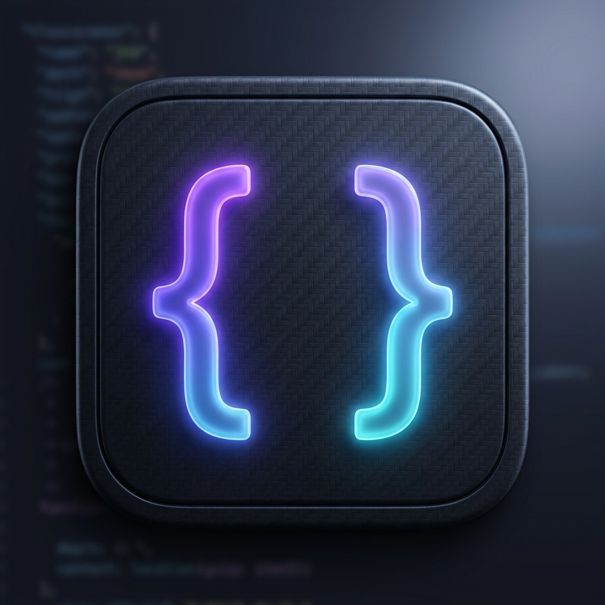

<p align="center">
  
</p>

<h1 align="center">JSONEdit</h1>

<p align="center">
  <strong>Uma IDE moderna, de alta densidade e colaborativa para edição de JSON.</strong>
</p>

<p align="center">
  
  
  
  
</p>

---

## 🚀 O que é o JSONEdit?

O **JSONEdit** é uma ferramenta profissional projetada para desenvolvedores que precisam de uma interface austera, rápida e funcional para manipular dados JSON. Diferente de formatadores web comuns, o JSONEdit oferece uma experiência de **IDE nativa** completa, com suporte a colaboração em tempo real e atalhos de teclado.

## ✨ Funcionalidades Principais

- 💻 **Interface IDE High-Density**: Layout edge-to-edge inspirado no VS Code, otimizando 100% do espaço de tela.
- 🤝 **Colaboração em Tempo Real**: Edite o mesmo arquivo com múltiplos usuários através de WebSockets.
- 🖥️ **App Desktop Nativo**: Disponível para Windows, macOS e Linux (via Tauri v2).
- 🌓 **Dark/Light Mode**: Tema escuro profundo e tema claro de alto contraste.
- ⌨️ **Atalhos de Produtividade**: Suporte a `Ctrl + S` para salvar e navegação rápida.
- 📊 **Status Bar Utility**: Indicadores de "Ready", "Unsaved Changes" e notificações de digitação em tempo real.
- 📂 **Tree & Code View**: Alterne instantaneamente entre visualização em árvore hierárquica e editor de texto puro.
- 🛡️ **Data Safety**: Validação de fechamento para evitar perda de dados não salvos.

## 🛠️ Tech Stack

- **Frontend**: Angular 21 + Material Design
- **Desktop Runtime**: Tauri v2 (Rust)
- **Editor Core**: JSONEditor (Ace Editor)
- **Comunicação**: Socket.io para colaboração externa
- **CI/CD**: GitHub Actions para builds automáticos multi-plataforma

## 📦 Como Rodar o Projeto

### Pré-requisitos
- Node.js (v20+)
- Rust & Cargo (Para a versão Desktop)

### Desenvolvimento Web
```bash
# Instalar dependências
npm install --legacy-peer-deps

# Rodar servidor local
npm run start
```

### Desenvolvimento Desktop (Tauri)
```bash
# Rodar o app nativo em modo dev
npm run desktop
```

### Gerar Instaladores (Produção)
```bash
# Gerar o pacote .rpm (Linux), .exe (Windows) ou .dmg (Mac)
npm run build:desktop
```

## 🏗️ Estrutura do Projeto

- `/src`: Código fonte do frontend Angular.
- `/src-tauri`: Código fonte nativo em Rust e configurações do Tauri.
- `/.github/workflows`: Automação de CI/CD para gerar releases de macOS e Windows.

---

<p align="center">
  Desenvolvido com ❤️ por <strong>Tilt Tecnologia</strong>
</p>
